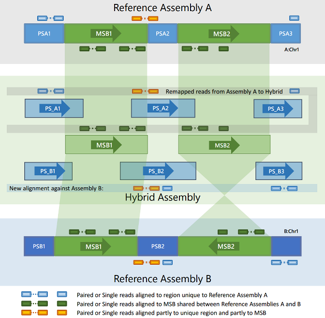
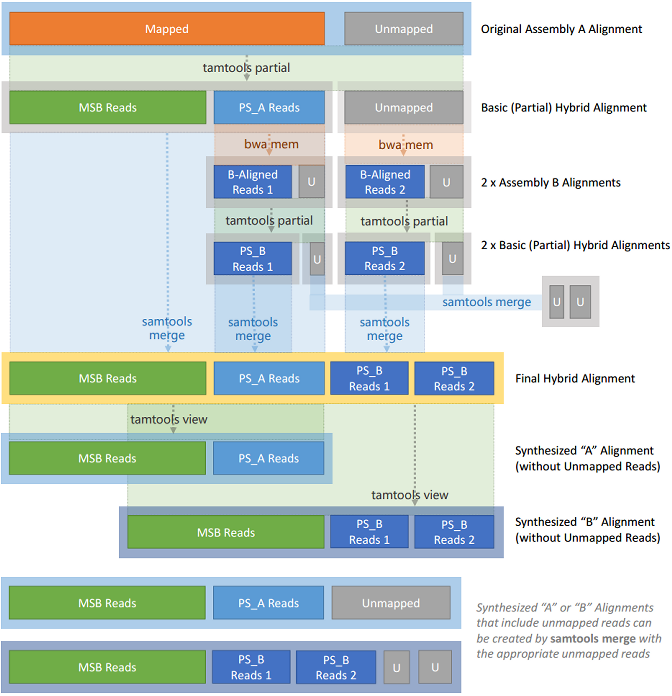

# TAMtools

TAMtools builds MSB maps between two assemblies, generates hybrid alignments, transforms
such hybrid alignments to synthetic alignments against either of the original
assemblies, and performs a number of related tasks.

This README contains:

* documentation for TAMtools commands
* technical notes for developers
* a list of known issues

## TAMtools Commands

Running `tamtools` or `tamtools -h` will give a brief summary of supported commands,
which are currently:

* `tamtools makemap`
* `tamtools hybridize`
* `tamtools partial`
* `tamtools view`
* `tamtools stats`
* `tamtools liftover`
* `tamtools daemon`
* `tamtools client`

A brief overview of each of these commands is given here. More help and usage
information is available on the command line by running `tamtools <command>` for any
supported command.

### tamtools makemap
`tamtools makemap` creates a hybrid reference assembly (in FASTA format) and the corresponding
mapping file for any two reference assemblies:

`tamtools makemap [-o output_dir] <blocklength> <ref_a.fa> <ref_b.fa>`

where `blocklength` is the minimum required size in bases of any MSB, and `ref_a.fa`
and `ref_b.fa` are the paths to the two reference assembly FASTA files. 

If an output
directory is not specified using the `-o` flag, then the hybrid mapping file and hybrid
reference FASTA file will by default be created in the current working directory.

`tamtools makemap` currently makes use of [MUMmer 3](http://mummer.sourceforge.net/ "MUMmer 3.0") to find all maximal unique
matches of length greater than or equal to `blocklength` between the two reference
assemblies. These matches, which may occur on forward or reverse strands, determine
coordinates for the resulting MSBs. To run `tamtools makemap`, the location of a 64-bit
`mummer` binary must be added to the `PATH` environment variable.

### tamtools hybridize
tamtools hybridize is a fully automatic workflow which converts an original reference
alignment to a full hybrid MSB alignment. The hybrid alignment can be used
to subsequently synthesize an alignment against either of the two original reference
assemblies. Its usage is shown below:

`tamtools hybridize [-i ref_aln.bam] <output_dir> <map_file> <ref_assembly_id>`

where `output_dir` is the directory into which the new hybrid alignment file and any
unmapped reads against either original reference will be stored, `map_file` is the path to
the mapping file generated by `tamtools makemap`, and `ref_assembly_id` is the ID (*1* or
*2*) of the assembly against which the original alignment was made. (Note that the IDs
for both reference assemblies are defined in the mapping file, and can be determined
using `tamtools stat`s). If an alignment file is not specified using the `-i` flag, then the
tool will read from `stdin`. For example:

    # specify an input aligment file:
    tamtools hybridize -i ref1_aln.bam output_dir/ msb.map 1
    
    # or redirect stdout to tamtools:
    cat ref1_aln.bam | tamtools hybridize output_dir/ msb.map 1
    
    # or redirect stdin to tamtools:
    tamtools hybridize output_dir/ msb.map 1 < ref1_aln.bam
    
This command effectively performs the following workflow:

1. Creates a partial hybrid alignment against the hybrid reference (as per `tamtools partial` command;
2. Aligns any "private" reads to the second reference assembly, then creates a partial hybrid alignment for these results;
3. Aligns any originally unmapped reads to the second reference assembly, then
creates a partial hybrid alignment for these results;
4. Merges the three partial hybrid alignments into a single ’full’ hybrid alignment.

Reads that are unmapped with respect to each of the two original reference assemblies
are stored separately from the hybrid alignment. Users may wish to merge these
unmapped reads with any results obtained from `tamtools view`.

The alignment steps (2 and 3 above) currently make use of the [BWA Aligner](http://bio-bwa.sourceforge.net/ "BWA Aligner"). To
run `tamtools hybridize`, the location of a `bwa` binary (with *bwa mem* support) must be
added to the `PATH` environment variable.

Should a user wish to employ an alternate aligner, then the `tamtools partial` command
can be used instead (and a workflow for the above steps would also need to be manually
implemented).

Here is a schematic representation of the full workflow implemented by `tamtools hybridize`:

### tamtools partial
`tamtools partial` produces a "partial" hybrid alignment, which means only the original
mapped reads are processed, and are remapped to MSB regions or to private regions
specific to the original assembly (and not to a second assembly).

A partial hybrid alignment is, by itself, of limited utility – but it does allow a user build
a full hybrid alignment while using a different aligner (i.e. not the default BWA) to
realign the remaining unmapped reads and any "private" reads from the first reference
to the second reference. In general, however, for a "full" hybrid alignment it is simplest
to use the `tamtools hybridize` command, which automates the entire process.

`tamtools partial` is used as in the following examples:

	# convert all mappable reads to a hybrid alignment, and ignore unmapped reads:
	tamtools partial -i ref1_aln.bam -o hybrid_alignment.bam msb.map 1

	# or convert all mappable reads to a hybrid alignment, and save unmapped reads:
	tamtools partial -i ref1_aln.bam -o hybrid_alignment.bam -u unmap.bam msb.map 1

The partial command can also read from to `stdin` and/or write to `stdout`; for example:

	# redirect stdout to tamtools, and specify output file:
	cat ref1_aln.bam | tamtools partial -o hybrid_alignment.bam msb.map 1

	# or redirect stdout to tamtools, and redirect stdout to file:
	cat ref1_aln.bam | tamtools partial msb.map 1 > hybrid_alignment.bam

	# or specify input alignment file, and redirect stdout to file:
	tamtools partial -i ref1_aln.bam msb.map 1 > hybrid_alignment.bam

	# or redirect stdin to tamtools, and specify output file:
	tamtools partial -o hybrid_alignment.bam msb.map 1 < ref1_aln.bam

### tamtools view

`tamtools view` uses a hybrid alignment to synthesize an alignment against the original
or new reference. It will produce an alignment in the same format as the hybrid
alignment (i.e. SAM, BAM or CRAM). For example:

	# Synthesize an alignment against the first assembly:
	tamtools view -i hybrid_alignment.bam -o ref1_aln.bam msb.map 1
	
	# Synthesize an alignment against the second assembly:
	tamtools view -i hybrid_alignment.bam -o ref2_aln.bam msb.map 2

As with most tamtools commands, tamtools view can also read from `stdin` and/or
write to `stdout`:

	# redirect stdout to tamtools, and specify output file:
	cat hybrid_alignment.bam | tamtools view -o ref1_aln.bam msb.map 1

	# or redirect stdout to tamtools, and redirect stdout to file:
	cat hybrid_alignment.bam | tamtools view msb.map 1 > ref1_aln.bam

	# or specify input file, and redirect stdout to file:
	tamtools view -i hybrid_alignment.bam msb.map 1 > ref1_aln.bam

### tamtools stats
`tamtools stats` shows information about an MSB map, including the IDs (*1* or *2*) of
each of the original reference assemblies, the sizes and MSB proportions of each contig
in each of these assemblies, and some summary statistics including the MSB N50. It requires as a parameter
the path to the hybrid map:

    tamtools stats human_h37_h37_1000/map/msb.map

### tamtools liftover
`tamtools liftover` emulates the behaviour of the [USCS liftOver](https://genome.ucsc.edu/util.html) tool, but using the
MSB mapping file generated with `tamtools makemap` instead of a UCSC chain file.
This allows annotations to be translated from one assembly to the other. Annotations
must be in BED format. Example usage is as follows:

	# liftover to output.bed and write unmapped to separate file:
	tamtools liftover msb.map 2 h38snp_chr_1.bed output.bed unmapped.bed

	# use heuristics to translate names between GRC/NCBI/USCS format (e.g
	# chr1, chrX, and chrM to 1, X and MT respectively):
	tamtools liftover -t msb.map 1 h37snp_chr_1.bed output.bed unmapped.bed

### tamtools daemon
`tamtools daemon` launches an HTTP-based coordinate remapping service, allowing
translation of coordinates to or from a hybrid reference (see also `tamtools client`).
By default, the service listens on port 2003 of the loopback address:

	# listen on 127.0.0.1:2003
	tamtools daemon msb.map

	# listen on 127.0.0.1:8000
	tamtools daemon -p 8000 msb.map

	# quiet mode - do not log requests to console:
	tamtools daemon -q msb.map

### tamtools client
`tamtools client` is a simple command line client that queries an HTTP service (see
`tamtools daemon`) to remap coordinates to/from a hybrid reference or between the two
original assemblies. Usage is as follows:

	# convert a ref assembly 2 coordinate to a hybrid coordinate:
	tamtools client localhost 2003 forward 2 chr1 1524810 1524830 -
	# returns: (’MSB_61:178400’, 72523, 72543, ’-’)

	# convert a hybrid coordinate to a ref assembly 2 coordinate:
	tamtools client localhost 2003 backward 2 MSB_61:178400 72523 72543 -
	# returns: (’chr1’, 1524810, 1524830, ’-’)

	# convert a hybrid coordinate to a ref assembly 1 coordinate:
	tamtools client localhost 2003 backward 1 MSB_61:178400 72523 72543 -
	# returns: (’1’, 1460190, 1460210, ’-’)

	# convert a ref assembly 2 to a ref assembly 1 coordinate:
	tamtools client localhost 2003 translate 2 chr1 1524810 1524830 -
	# returns (’1’, 1460190, 1460210, ’-’)

	# convert a ref assembly 1 to a ref assembly 2 coordinate:
	tamtools client localhost 2003 translate 1 1 1460190 1460210 -
	# returns (’chr1’, 1524810, 1524830, ’-’)

## Developer Notes

Here are some brief technical notes on the most important high level functions implemented in `tamtools`:

### `mummer_make_map()`

Invoked by the `tamtools makemap` command, this function runs`mummer` to find maximal unique matches of length *block_length* or greater between the two original reference assemblies, and parses the output to create a conceptual mapping between such shared regions in each assembly. From this, an intermediate output file in a format very close to that of a genome coordinate mapping chain file is produced. Note that this intermediate file is not yet in exactly the right format to be a valid chain file for use with other programs such as [UCSC's liftOver](https://genome.ucsc.edu/util.html); this is intended to be implemented in future versions of TAMtools. Finally, the `create_hybrid_fasta()` function is invoked to produce the proprietary hybrid map of MSBs and implied Private Segments, along with the corresponding hybrid reference assembly in FASTA format.

### `load_mapping_file()`

Most other high level functions use `load_mapping_file()` to load a hybrid map into memory and to generate forward and reverse mappings between both assemblies and the hybrid assembly. To avoid loading large FASTA files, the various summary data stored in the hybrid map file, such as the original assemblies' contig names and lengths, are also loaded by this function.

### `remap_sample()`

`remap_sample()` iterates through the reads in an input alignment and remaps their coordinates to a different assembly. If provided with an input alignment against either of the two original assemblies, then read coordinates will be remapped to the hybrid assembly. If provided with an input alignment against hybrid assembly, then read coordinates will be remapped to the the whichever of the two original assemblies the user specifies. Originally unmapped reads will, optionally, be stored to file. Reads that are QC fail are, currently, quietly discarded. The helper functions `process_single_read()` and `process_paired_read()` are invoked as appropriate for each read; Both attempt to recreate valid SAM flags for the reads, but further work is warranted to ensure the current behaviour is correct.

### `remap_coordinates()`

Functions that use `load_mapping_file()` will generally then use `remap_coordinates()` to convert coordinates from either of the two original assemblies to coordinates on the hybrid assembly, or vice versa. This forms the core of the `tamtools partial` command.

### `full_hybridization()`
 
This is an implementation of the `tamtools hybridize` workflow described above. An alignment against an original reference is remapped to the hybrid reference, and the results sorted. Two FASTQ files are created: one from any originally unmapped reads, and one from  reads that mapped to Private Segments on the hybrid assembly. Using `bwa mem`, both FASTQ files are used to create alignments against the second original reference, and these alignments are subsequently remapped to the hybrid reference. The three hybridized alignments are merged and sorted to form the final hybrid alignment. The unmappable reads for each of the original assemblies are stored independently. For debugging purposes, the current implementation uses temporary files which are deleted after the workflow is complete; it is anticipated that performance could be improved by using named pipes instead of temporary files.

## Known Issues

While TAMtools currently performs well as a proof of concept, there are  known issues which should be resolved before the software can be considered suitable for release:

* TAMtools supports the processing of alignments in SAM, BAM and CRAM format, but cannot currently read CRAM-format data from `stdin`; CRAM-format alignments must be in a file, and specified with the `-i` flag. This is caused by an underlying issue in the [Pysam](https://github.com/pysam-developers/pysam) module used by TAMtools.

* When iterating through an input alignment file, if the current read is one of a pair then a seek is performed for the mate; this affects performance. If the input alignment file were guaranteed to be originally sorted then simple iteration would permit instant location of paired reads, and improve performance. This could perhaps be made a condition of using the tool, and the seek behaviour removed.

* Insert lengths for remapped paired reads are not currently calculated correctly. The workaround is for the `tamtools hybridize` workflow to use the `samtools fixmate` command (via the Pysam API). Despite this, the resulting TLEN values do not always agree with the TLEN values shown in the original alignment file. The reasons for the differences are unclear at this stage.

* During tests with certain hg37 alignments (for example a 70GB \verb|hs37d5 BAM|), the resulting hybridized alignment file was corrupted (causing SAMtools commands such as `samtools view` to crash with a segmentation fault). This is likely to be caused by edge case bugs in the paired read remapping logic inserting invalid records into the output BAM file (one example is insertion of a record with a read group tag of "`RG:A:1`" instead of "`RG:Z`"; the root cause of this error has not been identified at the time of writing, and a workaround of setting all existing read group flags to "`RG:Z`" has been implemented temporarily). These issues require considerable further testing with different data sets.

* For any reasonable *block_length* (including the 1Kbp *block_length* widely used in this project), any small subset of read pairs with an insert length greater than this may not be mappable to a single hybrid contig (MSB or Private Segment), but might instead be mapped to two different hybrid contigs (one read to each). These special cases could legitimately be split up in this way, with the original coordinates being recorded in custom SAM tags for use in the reverse-mapping process. The logic to handle this has not yet been implemented, and such reads are currently treated as unmapped reads.

* On either side of an ALT-represented allele, the ALT contig includes a segment of sequence identical to that of the primary assembly. If these flanking sequences are larger than the minimum *block_length* then they will be represented as MSBs (and, in such cases, partially within a Private Segment). If smaller than the minimum *block_length*, then the allelic sequence and both its flanking sequences will be represented entirely within a single unique Private Segment. 

* The existence of ALT-contigs means that a read which mapped to the primary assembly in some reference *A* may potentially map to multiple contigs in reference *B* (to, for instance, its primary assembly and multiple ALT-contigs). When transforming a hybridized alignment into a synthetic Reference *A*  or *B* alignment, TAMtools will preferentially remap reads to the *primary* assembly of the target reference where possible. Reads will only ever be remapped to an ALT-contig of the target reference in cases were they a) cannot be exactly mapped to the primary assembly of the target reference, and b) can be exactly mapped to an ALT-contig. In such cases, if a read can be validly remapped to a set of two or more ALT-contigs, then TAMtools will remap the read to an arbitrary member of this set.
 
  At present, therefore, such reads may not be remapped to the most appropriate region on the second assembly. A workaround would be to modify TAMtools to include a custom SAM tag recording the original ALT-contig and coordinates for such reads when storing them in the hybrid alignment file, and to refer to this when synthesizing an alignment to the original reference assembly.
